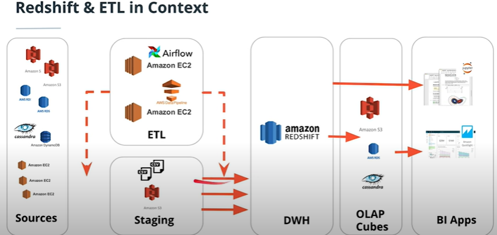

# Data Warehouse: From S3 bucket to redshift via ETL pipeline

### Table of Contents

1. [Project Introduction](#intro)
2. [Project Details](#details)
3. [Files](#files)
4. [Data Model](#model)
5. [How To Run](#execution)
6. [Licensing](#licensing)

## Project Introduction<a name="intro"></a>

This project is part of the Udacity Nanodegree Data Engineer. The goal is to apply the newly adopted skills about data warehouses. The course and therefore the project focuses on AWS technologies redshift and S3. The goal is to create a data warehouse in redshift with the neccessary roles and setup, to create tables in that data warehouse, copy data from S3 buckets and insert this data into facts and dimension tables. These final tables shall be the basis for analytics.

## Project Details<a name="details"></a>

The data used in this project is fictional data from a music streaming service called Sparkify, that has grown their user base and song database and wants to move their data in the cloud. The source data lays in S3 buckets in a directory of JSON logs. 

The first data source is about the user activity on the app. The files contain data in json format that show entries of user interactions/which page they visited in the app and some more details about their visit. 
Is is partitioned as the following shows:
log_data/2018/11/2018-11-12-events.json
log_data/2018/11/2018-11-13-events.json

Here is an example of the data format:


The second data source contains metadata about the songs in the app. It is partitioned as the following shows:
song_data/A/B/C/TRABCEI128F424C983.json
song_data/A/A/B/TRAABJL12903CDCF1A.json

Here is an example of the data format:
{"num_songs": 1, "artist_id": "ARJIE2Y1187B994AB7", "artist_latitude": null, "artist_longitude": null, "artist_location": "", "artist_name": "Line Renaud", "song_id": "SOUPIRU12A6D4FA1E1", "title": "Der Kleine Dompfaff", "duration": 152.92036, "year": 0} 

The goal is to build an ETL pipeline that extracts data from S3, stages them in redshift and transforms the data into a set of dimensional tables for the analytics team to work with it.



## Files <a name="files"></a>

Here you can see the files of the project with a short description:

```
Data Warehouse: From S3 bucket to redshift via ETL pipeline
│
├── README.md
├── config_redshift.cfg -->config file with all necessary details to create and delete a cluster
├── dwh.cfg -->config file with all necessary details to run the created cluster on aws
├── create_cluster.py --> configures IAM role, creates and starts the redshift cluster with a TCP port
├── create_tables.py --> creates the tables
├── etl.py --> stages data from S3 in redshift cluster and inserts data into star schema tables with fact and dimensional tables
├── delete_cluster.py --> deletes cluster and detaches role
├── sql_queries.py --> contains all queries
├── helpfolder_prototype/
    ├── create_redshift_cluster.ipynb --> jupyter notebook for developing the automated cluster creation and deletion code
    ├── config_redshift.cfg -->config file with all necessary details to create and delete a cluster for the jupyter notebook, same content as other config_redshift file
├── images/
├── LICENSE
```

## Data Model<a name="model"></a>

First of all the staging tables are created in order to copy the data from S3 into redshift.
The following staging tables are created:

- Staging Tables
  - staging_events
  - staging_songs

Based on these staging tables the fact table and the dimension tables are created:
- Fact Table
  - songplays - records in event data associated with song plays i.e. records with page NextSong - songplay_id, start_time, user_id, level, song_id, artist_id, session_id, location, user_agent

- Dimension Tables
  - users - users in the app - user_id, first_name, last_name, gender, level
  - songs - songs in music database - song_id, title, artist_id, year, duration
  - artists - artists in music database - artist_id, name, location, lattitude, longitude
  - time - timestamps of records in songplays broken down into specific units - start_time, hour, day, week, month, year, weekday

The fact and dimension tables are created through insert statements based on the staging tables.
 
## How To Run<a name="execution"></a>

- STEP 1:  Create IAM user and note AWS access key and the secret key
  - Create a new IAM user in your AWS account
  - Give it `AdministratorAccess`, From `Attach existing policies directly` Tab
  - Take note of the access key and secret and add both keys into the config_redshift.cfg
  - Additionally fill the following fields with your information:
      - DWH_IAM_ROLE_NAME=...
      - DWH_CLUSTER_IDENTIFIER=...
      - DWH_DB=...
      - DWH_DB_USER=...
      - DWH_DB_PASSWORD=...
      
- STEP 2: Fill out the following information in the dwh.cfg file:
  - DB_NAME=... (=DWH_DB in config_redshift.cfg)
  - DB_USER=... (=DWH_DB_USER in config_redshift.cfg)
  - DB_PASSWORD=... (=DWH_DB_PASSWORD in config_redshift.cfg)

- STEP 3: Start up Redshift cluster by running the following in the Terminal:
  - `python create_cluster.py `

- STEP 4: As instructed by the comments in the Terminal, note down the output to the Endpoint and the Role ARN and write it into the dwh.cfg file:
  - Fill the endpoint in 'host'
  - Fill the role ARN in 'ARN'

- STEP 5: Drop old tables if exists and create new tables in redshift cluster by running the following in the Terminal:
   - `python create_tables.py`

- STEP 6: Copy the data from the JSON files in the S3 bucket, stage it on the redshift cluster and insert the data into the facts and dimension tables by running:
  - `python run_ETL.py`
  
- STEP 7: Now you can check the tables using the Query editor in redshift

- STEP 8: After you are done, you can delete the cluster by running the following in the terminal:
  - `python delete_cluster.py`


## Results<a name="results"></a>

The project resulted in a pipeline in the following structure: An ETL Server issues the commands that the specified data from S3 is copied into staging tables on the redshift cluster. The data is then restructured in redshift by queries and inserted into the fact and dimension tables. Based on these tables the analytics department can now do their queries.

## Licensing<a name="licensing"></a>

I give credit to Udacity for the data.

Feel free to use my code as you please:

Copyright 2022

Permission is hereby granted, free of charge, to any person obtaining a copy of this software and associated documentation files (the "Software"), to deal in the Software without restriction, including without limitation the rights to use, copy, modify, merge, publish, distribute, sublicense, and/or sell copies of the Software, and to permit persons to whom the Software is furnished to do so, subject to the following conditions:

The above copyright notice and this permission notice shall be included in all copies or substantial portions of the Software.

THE SOFTWARE IS PROVIDED "AS IS", WITHOUT WARRANTY OF ANY KIND, EXPRESS OR IMPLIED, INCLUDING BUT NOT LIMITED TO THE WARRANTIES OF MERCHANTABILITY, FITNESS FOR A PARTICULAR PURPOSE AND NONINFRINGEMENT. IN NO EVENT SHALL THE AUTHORS OR COPYRIGHT HOLDERS BE LIABLE FOR ANY CLAIM, DAMAGES OR OTHER LIABILITY, WHETHER IN AN ACTION OF CONTRACT, TORT OR OTHERWISE, ARISING FROM, OUT OF OR IN CONNECTION WITH THE SOFTWARE OR THE USE OR OTHER DEALINGS IN THE SOFTWARE.
